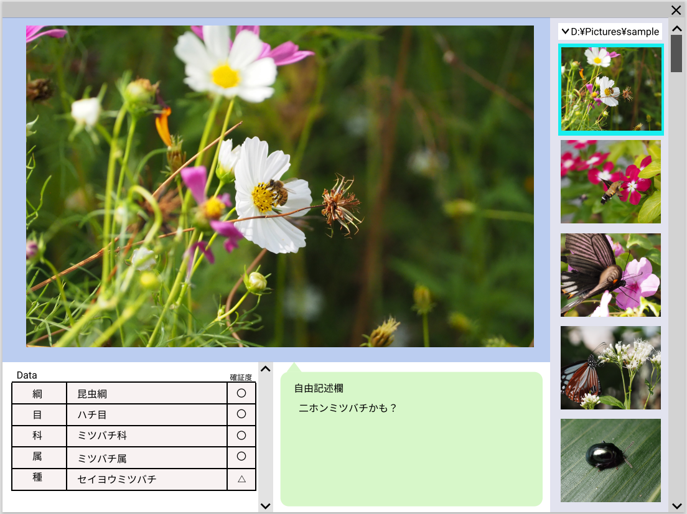
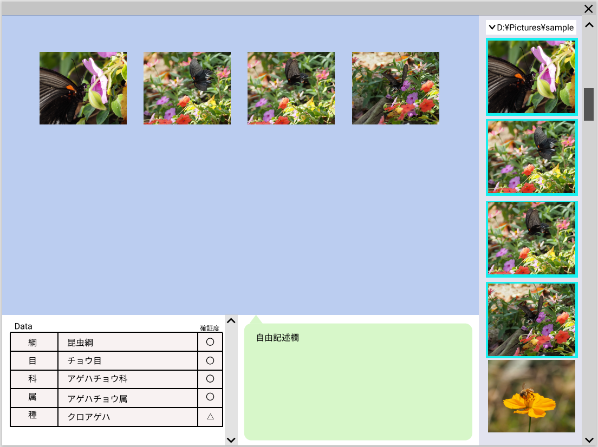
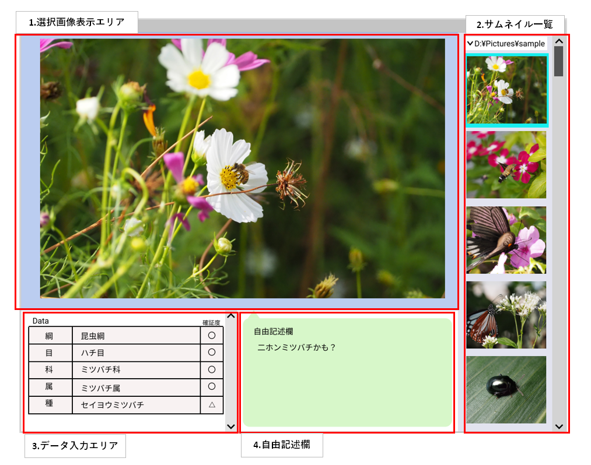

## 基本画面

## 基本画面各部の詳細

※▲マークを付けている仕様は優先度低。

- 1.選択画像表示エリア  
  - サムネイルで選択した画像が大きく表示される。  
  - 選択画像表示エリアをクリックしてフォーカスを当てた状態で↑または↓キーを押すと、サムネイル一覧に表示されている上または下の画像に切り替わる
  - ▲画像の任意の位置にポインタを置いた状態でCtrlキーを押しながらマウスホイールすると、その位置が拡大表示される。  

- 2.サムネイル一覧  
  - 選択したフォルダに存在する画像ファイルがすべてサムネイルとして一覧表示される。  
  - Ctrlキーを押しながらクリックすることで、複数選択できる。  
  - Shiftキーを押しながらクリックすると、選択済のサムネイルからShiftキーを押しながらクリックしたサムネイルまでの画像がすべて複数選択される。  

- 3.データ入力エリア  
  選択されている画像に写っている昆虫についての情報を入力できる。
  - 左から1列目はデフォルトで入力されている。
  - 左から2列目はデフォルトでは空欄。ユーザーが入力する。  
    - ▲下位項目を入力すれば、上位項目は自動で入力される。  
      (昆虫分類のデータが利用できれば実現可能ではないかと思われるが、現在のところ利用できるものが見つかっていない)
      ⇒実現不可能ならすべて手入力で行う。
  - 左から3列目はデフォルトでは空欄。ユーザーがプルダウンで入力する。  
    "〇","△","×"の3種類の値が選択可能。  
- 4.自由記述欄  
  デフォルトでは空欄。  
  データ入力エリアに入力できない補足的な情報を入力する。